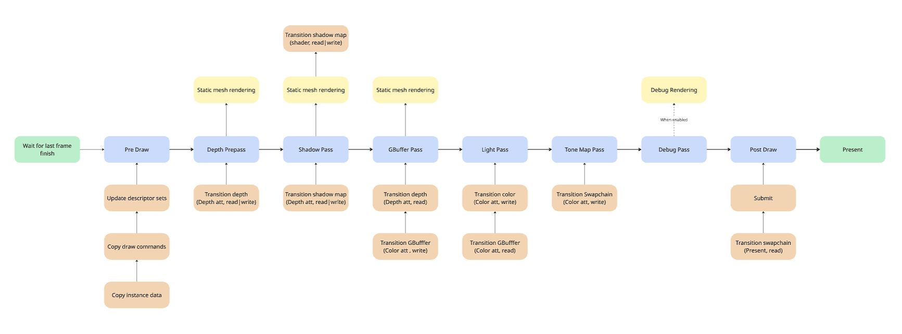
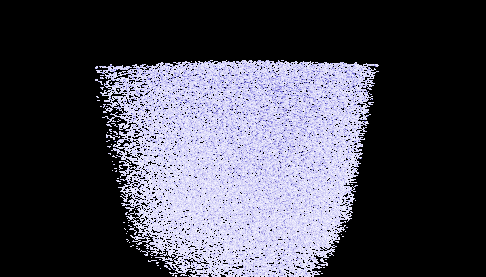
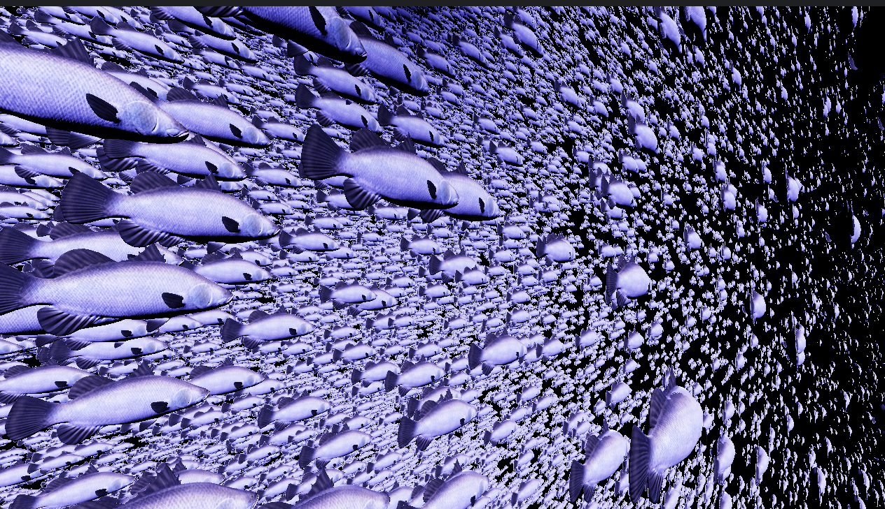

# 3D Game Engine Project

## Table of Contents
- [3D Game Engine Project](#3d-game-engine-project)
  - [Table of Contents](#table-of-contents)
  - [Introduction](#introduction)
  - [Demo](#demo)
  - [Core](#core)
	- [Logging](#logging)
	- [Debugging - Asserts](#debugging---asserts)
	- [Profiling](#profiling)
  - [Engine](#engine)
	- [Component System](#component-system)
	- [Renderer](#renderer)
	  - [Coordinate System](#coordinate-system)
	  - [Pipeline Overview](#Pipeline-Overview)
	  - [Features](#features)
	  - [Debug Rendering](#debug-rendering)
  - [Features I want to add inn the near future](#features-i-want-to-add-inn-the-near-future)
	  - [In the further future](#in-the-further-future)

## Introduction

## Demo
Demo scene can be found in Game/DemoScene.h and .cpp
Change the EDemo m_Demo; in the header to a different enum value to view different scenes.

Config
Config.cmake: build settings
Renderer/Config/VulkanConfigs: buffer sizes, extensions 
Core/Public/Config/EngineConfig.h: macros, general settings

Keybinds
F1 Profile
F2 Toggle light debug render (display spheres for point light, arrow for dir light)
F3 toggle light mode - point light only, dir light only, both
F4 toggle shadows
F5 lower light intensity 
F6 up light intensity
F7 Toggle rotation
F8 Toggle Debug render mode

Mouse movement, rotate cam
arrows / WASD cam movement
Sprint control

## Core

### Logging
The logger can log in the console and a file using different log priority levels and categories. Priority of logging can be adjusted to skip logging all levels below set level. Colors of the console logs are configurable.

The file logging has a configurable file size, before it rotates to the next file. Currently it simply keeps a single backup. If a full backup is stored and the new rotation happens, the backup is overwritten with the new file. The file also contains the log level more clearly and is timestamped.

```cpp
// logging can be done using the LOG macro or using the specifc _Priority level macro.
ME_LOG(MauCor::LogPriority::Error, MauCor::LogCategory::Game,"test {}", 1000);
ME_LOG_ERROR(MauCor::LogCategory::Game, "TEST");
```

Example of console logging (Renderer category, info & trace log level)


Example of file logging (contains time stamp, category & log level)


I do plan on supporting adding custom categories in the future (similar to Unreal Engines system).

### Debugging - Asserts
- Assert only triggers in debug, the message is an optional parameter that will be logged to the console / file logger.
- Check triggers in all builds, message is an optional parameter that will be logged to the console / file logger.
- Verify logs a warning in release builds, fails in debug. This means code in the macro is still executed in release. Message is an optional parameter that will be logged to the console / file logger.

| Macro       | Build Type  | Fails on Condition? | Removed in Release? | Use Case									|
|-------------|-------------|---------------------|---------------------|-------------------------------------------|
| ME_ASSERT	  | Debug-only  | Yes (fatal)         | Yes                 | Catching programmer errors				|
| ME_CHECK    | All builds  | Yes (fatal)         | No                  | Critical runtime invariants				|
| ME_VERIFY   | All builds* | No (log only)*      | No*                 | Validate logic without halting execution  |

```cpp
// Some assert examples
ME_ASSERT(std::filesystem::exists("Path123.txt"));
ME_CHECK(pRenderer, "Renderer must be valid");
ME_VERIFY(CalculateAndValidatePath(), "Path must be valid");
```

### Profiling
The engine has 2 available profilers, a very barebones profiler that simply parses to a .json file and can be uploaded to chrome://tracing/. The other profiler is an integration of the Optick library and provides a lot more information if required.

Profiling requires 2 steps. 
1. add the macros in all the functions & scopes you wish to profile: 
```cpp
// Examples
void MySleepFunc() {
	// Do stuff
	{
		ME_PROFILE_SCOPE("Main Thread Sleep");
		Sleep();
	}
}

void Render(){
	ME_PROFILE_FUNCTION();
}

```

2. Press F1 to start profiling & upload it to the exe or chrome://tracing/.

Profiling only happens when it is enabled in the Config.cmake file.


## Engine

## Component System
The engine currently uses a wrapper around entts component system, it supports almost all functions entt offers.

## Renderer
### Coordinate System
In this project, we use a right-handed 3D coordinate system with the following conventions:
**X-axis:** Represents the horizontal direction.
- Positive X moves to the right.
- Negative X moves to the left.

**Y-axis:** Represents the vertical direction (with Y-up convention).
- Positive Y moves upward.
- Negative Y moves downward.

**Z-axis**: Represents the depth direction.
- Positive Z moves forward (towards the camera's view).
- Negative Z moves backward (away from the camera's view).

### Pipeline Overview


### Features
- Instanced Rendering<br>
As a test I loaded a mesh with 100 000 instances. The mesh is a simple gun and has 1425 indices and 311 vertices. This runs very smoothly on my hardware (RTX 3060, 60 FPS cap but main thread was sleeping for +/-10ms and GPU had a lot of room left)



- Bindless (indirect) Rendering<br>
The renderer uses a global index and vertex buffer, draw commands are batched and issued using vkCmdDrawIndexedIndirect. Textures are in a descriptor array.

- Deferred rendering

- Dynamic rendering<br>

- Depth prepass<br>
Reduce overdaw by doing a depth prepass.

- Mesh & material support (loading a material from a file)<br>
Assimp is integrated, and all formats supported by Assimp can be used to load meshes & materials. Meshes are split up in submeshes, these submeshes are then instanced.
Default and invalid materials are used to prevent branching on the GPU.

- Lighting & Material<br>
 
- Tone map & Exposure<br>


### Debug Rendering
Easy to use API for debug rendering. See. Debug rendering demo.

```cpp
void GameScene::Tick()
{
	Scene::Tick();

	// start, end, colour
	DEBUG_RENDERER.DrawLine({0, 0,0 },  {0, 100, 100} );
	DEBUG_RENDERER.DrawLine({-10 , 10, -10}, {10, 10, 10}, { 0, 1, 0});

	// center, radius, colour, segmenets (per circle), layers
	DEBUG_RENDERER.DrawSphereComplex({20,20,20}, 20.f, { 1, 1, 1 }, 24, 10);
}
```

Result of that last example is this: 


## Features I want to add in the near future
- Image based lighting (skybox)
- Auto exposure
- GPU frustrum culling
- Deleting / hiding meshes
- Optimized scene AABB calculation for shadow maps
- Soft shadows
- ImGUI integration

### In the further future
- Animations
- Different Post processing effects

